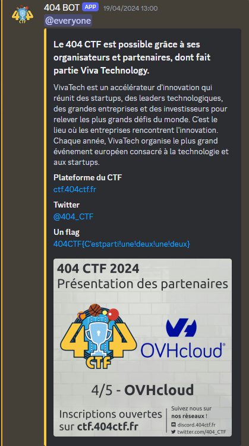

<h1></h1>
<h3>Introduction - <b>10pts.</b></h3> 

Rejoignez le <a href="https://discord.404ctf.fr/">Discord</a> discord de la compétition, un flag y est caché !

Nous pourrons uniquement aider sur les épreuves de niveau introduction. Cependant, si vous rencontrez un problème technique sur une des épreuves ou que vous avez un signalement à faire, vous pouvez demander à contacter un admin sur le channel dédié à la catégorie concernée.

PS : le café est offert !

<h3>Solution</h3>

Il suffisait de chercher dans Discord `404CTF{` et de tomber sur ce message dans le channel `#annonces` : 

Le flag est donc : <b>404CTF{C'estparti!une!deux!une!deux}</b>

