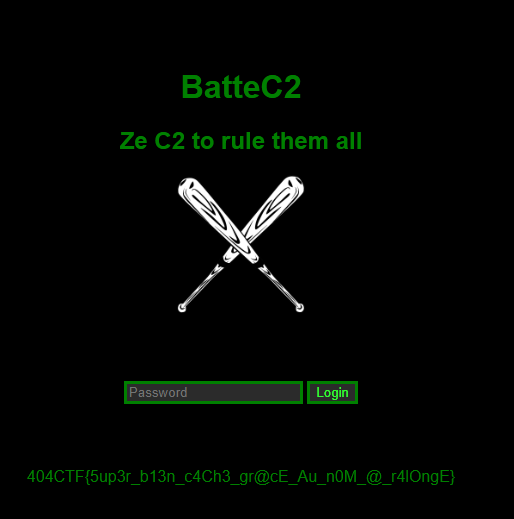

<h1></h1>
<h3> - <b>pts.</b></h3> 

<b>Suite du challenge x</b>

<i>Le challenge suivant sera disponible dans la catégorie Divers une fois que vous aurez validé celui-ci.</i>
 
Super ! Grace à vous j'ai pu retirer le fichier de mon PC, mais pensez-vous qu'il serait possible d'en savoir un peu plus sur ce malware ?

Retrouvez l'interface web du panneau de Command & Control du malware.

Le flag y sera reconnaissable.

Auteurs : @<b>Smyler</b>

<h3>Solution</h3>

Après avoir trouvé le SHA1 dans le challenge précédent, j'ai essayé de le trouver dans les bases de données en ligne, mais aucun résultat.

En revanche, sur virustotal, avec ce SHA1, on trouve bien un scan : <a href="https://www.virustotal.com/gui/file/439bfbdc4ef8d94d36273714d7ef4a709e7228f7daf85aaa1cd295354ee5cb98/behavior">https://www.virustotal.com/gui/file/439bfbdc4ef8d94d36273714d7ef4a709e7228f7daf85aaa1cd295354ee5cb98/behavior</a>, dans la zone DNS on voit qu'il y a un nom de domaine `takemeouttotheballgame.space`.

Après avoir essayer les ports les plus communs, aucun ne fonctionnent, j'ai utilisé un outil en ligne qui permet de lister les certificats d'un nom de domaine [https://crt.sh/](https://crt.sh/) _(il existe plusieurs façon de trouver le sous-domaine !)_, ce qui nous donne l'url suivante : [http://panel-5d4213f3bf078fb1656a3db8348282f482601690.takemeouttotheballgame.space](http://panel-5d4213f3bf078fb1656a3db8348282f482601690.takemeouttotheballgame.space)

Et on arrive sur la page suivante :

Le flag est donc : <b>404CTF{5up3r_b13n_c4Ch3_gr@cE_Au_n0M_@_r4lOngE}</b>