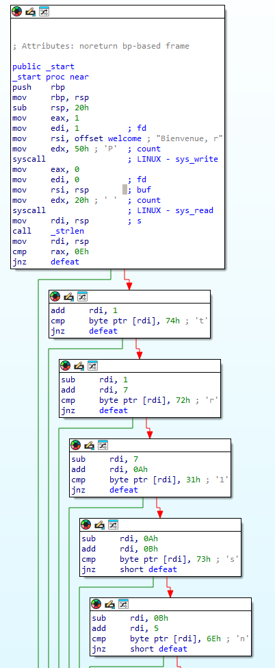

<h1>Intronisation du CHAUSSURE</h1>
<h3>Facile - <b>200pts.</b></h3> 
<p>Montrez votre valeur

Le CHAUSSURE, cette fameuse entité pionnière dans le domaine du sport de combat a ouvert un tournoi pour tous les chat-diateurs qui souhaiteraient se mesurer au reste du monde. Les présélections commencent et un premier défi a été publié par le CHAUSSURE. Ce dernier semble très cryptique, à vous d'en déceler les secrets!

Format de flag : `404CTF{mot-de-passe}`

<hr>

Fichier : 

<a href="./intronisation">intronisation</a>

Auteur : @<b>Narcisse</b></p>

<hr>

<h3>Solution</h3>

J'ai utilisé <a href="https://hex-rays.com/ida-free/">IDA (free)</a> pour décompiler le fichier. Ce qui nous donne une suite d'instructions (en bas de la capture d'écran) qui manipule des caractères.



Si on prend les caractères dans l'ordre : `tr1sn1u5n30pt`, malheureusement ça ne fonctionne pas comme flag, il faut alors remettre dans l'ordre tout ça. On prend la valeur de la fonction `sub` et ça donne :

```
t 1
r 7
1 10
s 11
n 5
1 4
u 2
5 0
n 9
3 12
0 8
p 3
t 6
```

Et donc `5tup1ntr0n1s3`.

Le flag est donc : <b>404CTF{5tup1ntr0n1s3}</b>