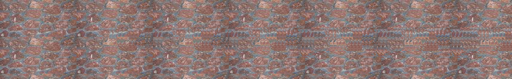
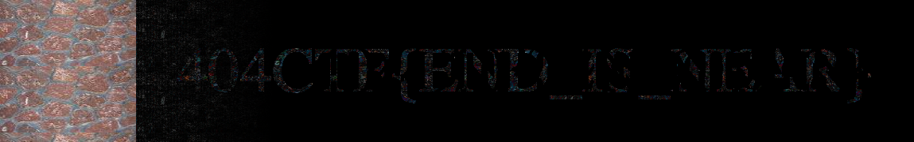

<h1></h1>
<h3> - <b>pts.</b></h3> 

Auteurs : @<b></b> & @<b></b>

<h3>Solution</h3>

Quand on ouvre l'image on ne voit rien à l'oeil nu, en editant le fichier pour espérer voir du contenu ajouté, non plus.

Mais on a quand même un énorme indice dans le titre, "Regarder en stéréo", il suffit alors de chercher un outil de stéréogramme. J'ai utilisé <a href="https://piellardj.github.io/stereogram-solver/">https://piellardj.github.io/stereogram-solver/</a>

Et on peut voir un flag apparaître :

Pour plus d'informations sur cette technique : <a href="https://piellardj.github.io/stereogram-solver/readme/">Stereogram solver</a>.

Le flag est donc : <b>404CTF{END_IS_NEAR}</b>