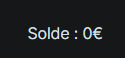
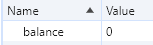
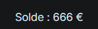

<h1>Le match du siècle [1/2]</h1>
<h3>Introduction - <b>100pts.</b></h3> 

Vous voilà à quelques semaines du match tant attendu entre le Gorfou FC et l'AS Sealion.
Seulement, vous vous êtes pris au dernier moment pour acheter votre place. Trouvez un moyen d'obtenir un billet !

Auteurs : @<b>callister</b>

Connexion :

`https://le-match-du-siecle.challenges.404ctf.fr`

<h3>Solution</h3>

En regardant un peu les différentes pages, pas grand chose d'utilisable, il faut un compte. Alors première chose, allons nous créer un compte.

Me voilà avec mon compte `toto`.

On remarque qu'on a un solde à 0 €, donc pas assez pour prendre un billet..

Mais dans les cookies il y a un qui a l'air de correspondre :

En l'éditant et en rafraichissant la page on voit que notre balance a également changé : 

Et avec tout cet argent, on peut se faire plaisir et acheter nos billets ! Et en retournant dans la page avec nos billets on peut avoir les billets achetés et on peut cliquer sur le bouton obtenir qui va télécharger une image, le flag.

Le flag est donc : <b>404CTF{b5a77ed0fa6968b21df7fb137437fae1}</b>