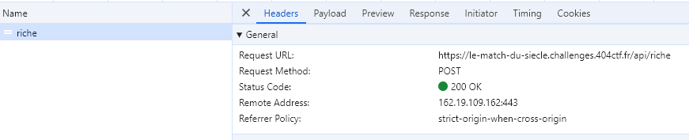
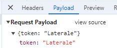
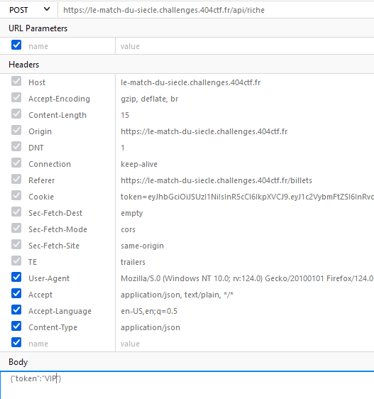

<h1>Le match du siècle [2/2]</h1>
<h3>Moyen - <b>200pts.</b></h3> 

Vous avez déjà en votre possession un billet, néanmoins, pour impressionner votre famille, vous souhaiteriez des places VIP.

Auteurs : @<b>callister</b>

Connexion :

`https://le-match-du-siecle.challenges.404ctf.fr`

<h3>Solution</h3>

<i>J'ai utilisé cette méthode pour trouver le flag, mais ce n'était pas la solution de base, il aurait fallut utiliser les JWT.</i>

Dans la partie 1, lors du téléchargement du billet, on remarque que le site web fait une requête à une API :

Avec une payload :

En achetant d'autres billets et en récupérant l'image on voit que les requêtes sont similaires et juste la payload change, donc en changeant le token par `VIP` et en la renvoyant :

Et hop, voilà le flag !

Le flag est donc : <b>404CTF{b7554ee60d0020216749d428830a55f1}</b>