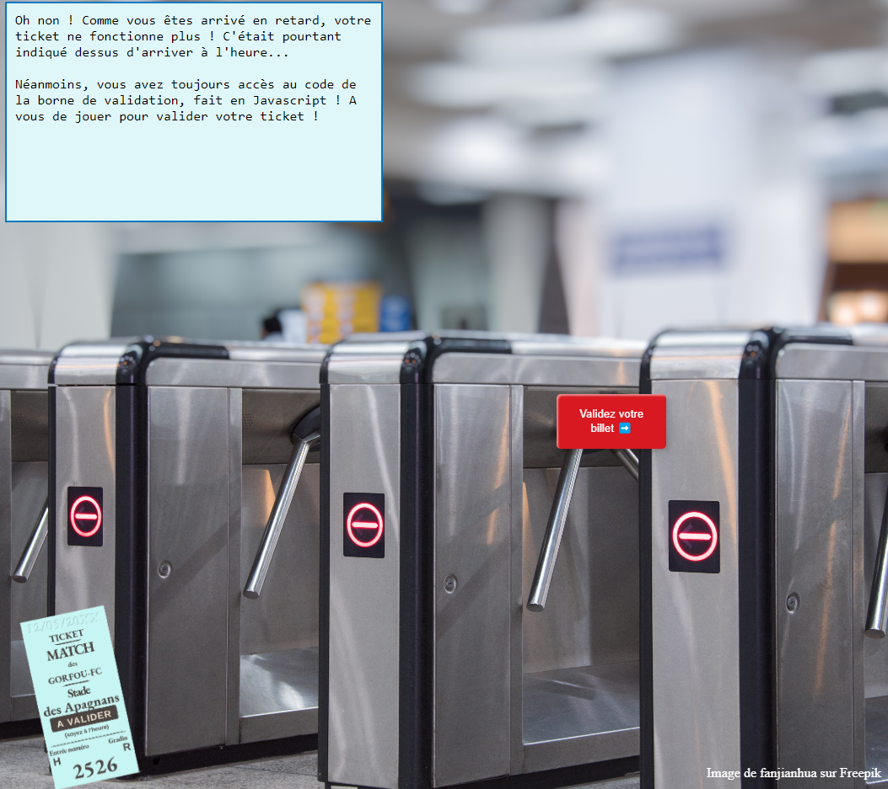
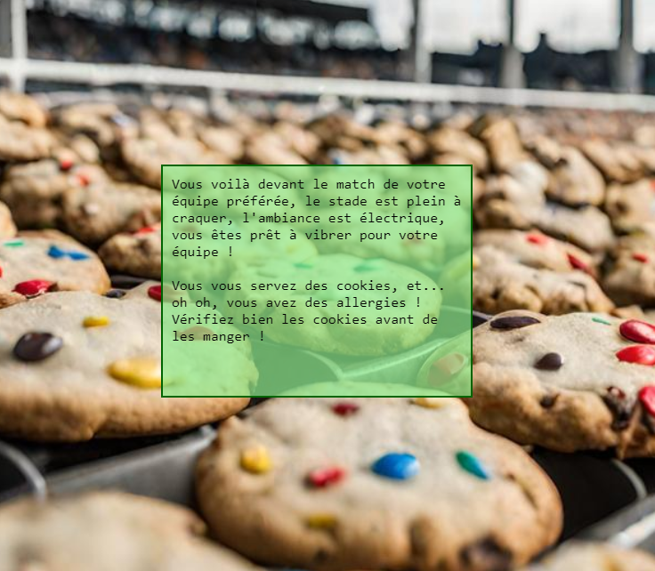
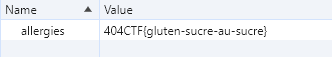

<h1>Vous êtes en RETARD</h1>
<h3>Introduction - <b>100pts.</b></h3> 
<p>Vous voilà devant le stade pour voir le dernier match de votre équipe préférée, le Gorfou FC !
Malheureusement, vous êtes arrivé.e en retard et l'entrée est fermée... Mais pas de panique, il vous suffit de trouver un moyen pour quand même rentrer !

Auteurs : @<b>Asumamusa</b></p>

<hr>

Connexion :

`https://en-retard.challenges.404ctf.fr`

<hr>

<h3>Solution</h3>

En supprimant le gros panneau rouge, avec n'importe quel navigateur avec le mode développeur on a alors accès à un bouton :


Et on peut accéder à cette nouvelle page (`/donnez-moi-mon-ticket-pitie`) :



En regardant le code source de la page on observe ce passage :

```javascript
<script>
    var bouton = document.querySelector('.valider-billet');
    var billet = document.querySelector('.billet');
    window.validable = [];
    bouton.addEventListener('click', function() {
        if (window.validable.includes(billet.id)) {
            fetch('/set_cookie', {method: 'POST'}).then(function() {
                window.location.href = "/devant-le-match";
            });
        } else {
            alert('Billet non validé');
        }
    });
</script>
```

Et dans le code HTML on peut voir également : 

```html

```

En faisant le lien avec le script Javascript, on comprend qu'il vérifie si l'ID est présent dans une liste (`validable`), et si oui une requête est effectuée.

J'ai alors ajouté cet ID dans la liste :

```javascript
window.validable.push("053HJ28LOS")
```

On clique sur le bouton pour valider le billet et nous voilà sur une belle page remplie de cookies.



Et dans nos cookies on en remarque un petit nouveau :)




Le flag est donc : <b>404CTF{gluten-sucre-au-sucre}</b>