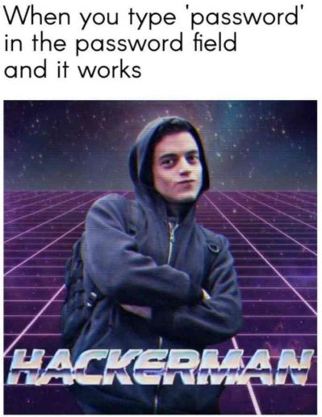

<h1>CTF Writeups</h1>

<i>Les CTFs sont des compétitions où les participants doivent résoudre des défis variés en matière de sécurité informatique, de cryptographie, de rétro-ingénierie et d'autres domaines connexes. Les writeups sont des documents qui décrivent la résolution de ces défis, fournissant des insights et des explications sur les méthodes utilisées pour les résoudre.</i>

Voici les différents CTF auxquels j'ai participé et les writeups associés :

<h3>2024</h3>

<ul>
    <li><a href="404CTF_2024/Readme.md">404CTF - [407/3271]</a></li>
</ul>

 

 

